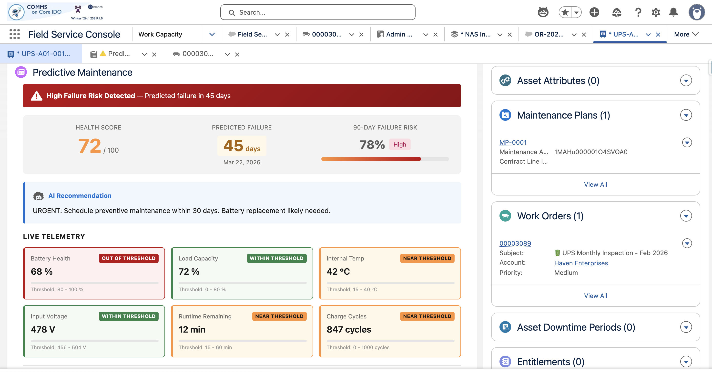
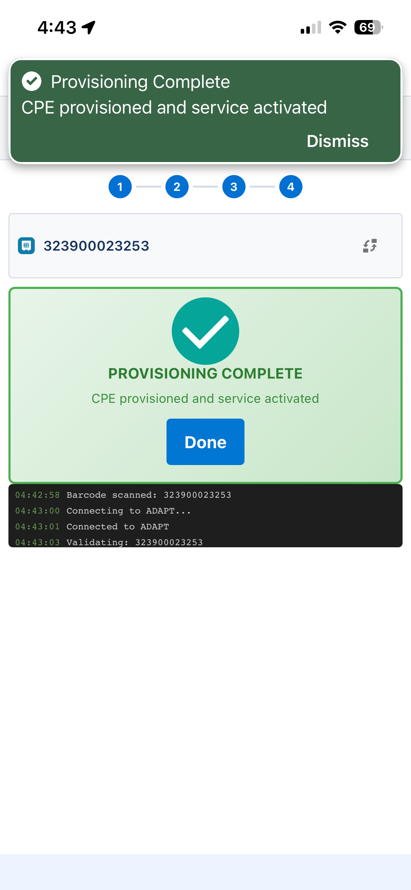
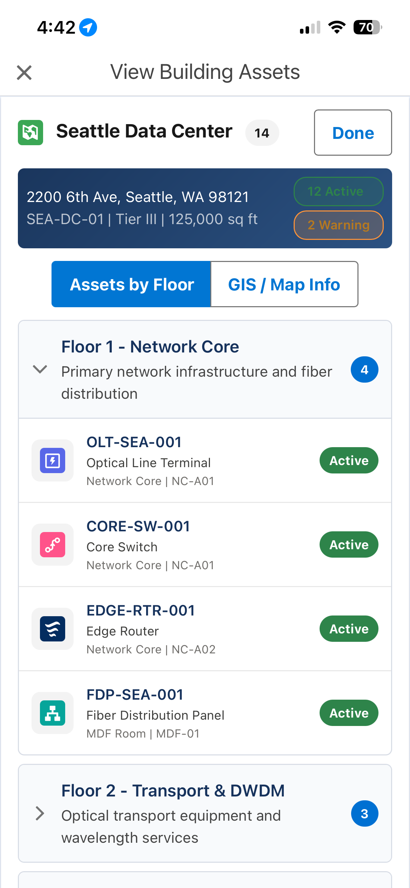
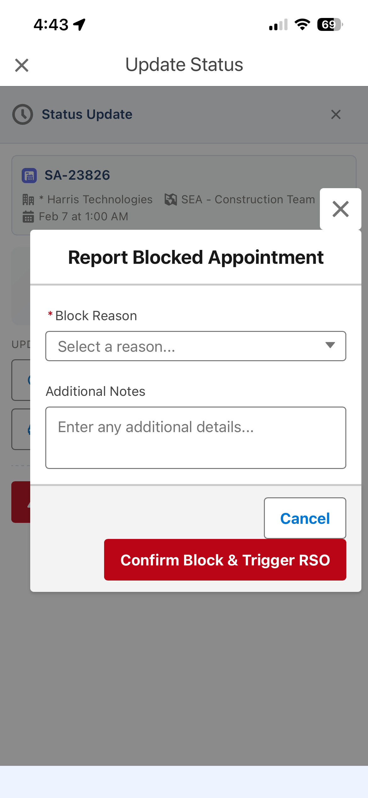

# FSL LWC Components

Lightning Web Components for Salesforce Field Service demos. Includes mobile-optimized components for technician workflows and desktop components for asset management.

## Components Overview

| Component | Platform | Apex Required | Offline | Purpose |
|-----------|----------|---------------|---------|---------|
| [predictiveMaintenance](#predictivemaintenance) | Desktop | Yes | No | AI-powered asset health dashboard |
| [cpeProvisioning](#cpeprovisioning) | Mobile | No | Yes | CPE/ONT provisioning workflow |
| [buildingAssetMap](#buildingassetmap) | Mobile | Yes | Partial | Digital twin floor-by-floor view |
| [saStatusUpdate](#sastatusupdate) | Mobile | Yes | Yes | SA status workflow with RSO |

---

## Prerequisites

- **Salesforce org with Field Service Lightning** (FSL managed package)
- **API Version:** 62.0+ (Spring '25)
- **Salesforce CLI** (`sf`) installed

---

## Quick Start

```bash
# 1. Clone this repo
git clone <repo-url>
cd fsl-lwc-components

# 2. Authenticate to your org
sf org login web --alias my-org

# 3. Deploy
sf project deploy start --target-org my-org
```

---

## Component Details

### predictiveMaintenance

**Purpose:** AI-powered predictive maintenance dashboard for Asset record pages

**What it does:**
- Displays health score (0-100) with animated gauge visualization
- Shows failure probability percentage and predicted failure date
- Live telemetry data with threshold indicators:
  - `WITHIN THRESHOLD` (green)
  - `NEAR THRESHOLD` (orange)
  - `OUT OF THRESHOLD` (red)
- Einstein AI recommendation section with suggested actions
- Action button: "Add Preventive Work" - creates a 7-step inspection Work Plan on an upcoming Work Order

**Screenshot:**


#### Data Requirements

| Object | Fields Used | Relationships |
|--------|-------------|---------------|
| **Asset** | Id, Name, Product2Id, Status, InstallDate | Asset → Product2, Asset → Account, Asset → Location |
| **WorkOrder** | Id, WorkOrderNumber, Subject, Status, StartDate | WorkOrder → Asset, WorkOrder → Location, WorkOrder → Account |
| **ServiceAppointment** | Status | SA → WorkOrder (ParentRecordId) |
| **WorkPlan** | Name, Description, WorkOrderId | Created by component |
| **WorkStep** | Name, Description, SortOrder, WorkPlanId | Created by component |

#### Key Relationships
```
Asset
├── Product2 (for product type: UPS, OLT, etc.)
├── Account (customer)
└── Location (physical location)

WorkOrder
├── Asset (equipment being serviced)
├── Location (same as Asset location)
└── ServiceAppointment (child records)
```

#### Test Data Setup
For the component to function properly, create:
1. **Asset** record with a `Product2` association
2. **WorkOrder** at the same `Location` as the Asset
3. **ServiceAppointment** linked to the WorkOrder

**Apex Controller:** `PredictiveMaintenanceController.cls`

**Page Placement:** Asset record page via Lightning App Builder

---

### cpeProvisioning

**Purpose:** CPE/ONT provisioning workflow for field technicians - simulates interaction with legacy provisioning systems

**What it does:**
- 4-step provisioning workflow:
  1. **Connect** - Establishes connection to ADAPT backend system
  2. **Validate/Provision** - Validates serial number, creates service profile, configures VLAN
  3. **Signal Test** - Tests optical signal strength, power, connection speed
  4. **Activate** - Enables data path and verifies connectivity
- Barcode scanner integration (uses device camera on mobile, simulated on desktop)
- Real-time provisioning log with timestamps
- ADAPT system status indicators (Disconnected → Connected → Provisioned → Activated)

**Screenshot:**


#### Data Requirements

| Object | Fields Used | Relationships |
|--------|-------------|---------------|
| **ServiceAppointment** | Id, AppointmentNumber, Status, ParentRecordId | SA → Account, SA → WorkOrder |
| **WorkOrder** | Id, WorkOrderNumber, Subject, AssetId | WO → Asset |
| **Asset** | Id, Name, SerialNumber | Asset → Product2 |

#### Key Relationships
```
ServiceAppointment
├── Account (customer name displayed)
└── WorkOrder (ParentRecordId)
    └── Asset (CPE being provisioned)
        └── Product2 (device type)
```

#### Test Data Setup
1. **Asset** with `SerialNumber` populated
2. **WorkOrder** linked to the Asset
3. **ServiceAppointment** linked to the WorkOrder

**Special Features:**
- **Offline Capable:** Uses GraphQL wire adapters for offline support
- **Demo Mode:** Works without real data - uses simulation for barcode scanning and provisioning steps

**Apex Controller:** None (pure LWC with GraphQL)

**Page Placement:** ServiceAppointment Quick Action or Screen Flow (mobile)

---

### buildingAssetMap

**Purpose:** Digital twin view of a data center with floor-by-floor asset inventory and GIS visualization

**What it does:**
- Interactive satellite map with toggleable GIS layers:
  - Fiber Backbone (blue lines)
  - Distribution (green lines)
  - Facility Zones (purple polygons)
  - Asset markers (orange dots)
- Floor-by-floor asset browser (4 floors):
  - Floor 1: Network Core (OLTs, Core Switch, Edge Router)
  - Floor 2: Transport & DWDM
  - Floor 3: Compute & Storage
  - Floor 4: Power & Cooling
- Asset detail view with telemetry attributes and threshold status
- Links to Google Maps and ArcGIS for external navigation
- Action: "Add Inspection Work Plan" for assets with warning conditions

**Screenshot:**


#### Data Requirements

| Object | Fields Used | Relationships |
|--------|-------------|---------------|
| **WorkOrder** | Id (recordId context) | Parent context for Work Plan creation |
| **WorkPlan** | Name, Description, WorkOrderId | Created by component |
| **WorkStep** | Name, Description, SortOrder, WorkPlanId | Created by component |

#### Demo Data Note
This component uses **hardcoded demo data** for the Haven Enterprises Bellevue Data Center. To customize for a different facility:

1. Modify `HAVEN_DATA_CENTER` constant (line 13-25)
2. Update `loadHavenDataCenterAssets()` method with your assets

**Apex Controller:** `BuildingAssetMapController.cls`

**Page Placement:** WorkOrder Quick Action or Screen Flow (mobile)

---

### saStatusUpdate

**Purpose:** Service Appointment status workflow with RSO (Resource Scheduling Optimization) triggering for blocked appointments

**What it does:**
- Current status display with color-coded badge and icon
- Next status suggestions based on current state:
  - Scheduled → Dispatched, Travel
  - Dispatched → Travel, In Progress
  - Travel → In Progress
  - In Progress → Completed, Cannot Complete
- "Cannot Complete" blocking with reason selection:
  - Customer Not Available
  - Equipment Failure
  - Parts Not Available
  - Access Issue
  - Weather Conditions
  - Safety Concern
  - Dependency Not Complete
  - Other
- Dependency chain visualization (shows upstream/downstream SAs)
- Triggers RSO for blocked appointments
- Posts to Chatter when appointments are blocked

**Screenshot:**


#### Data Requirements

| Object | Fields Used | Relationships |
|--------|-------------|---------------|
| **ServiceAppointment** | Id, AppointmentNumber, Status, StatusCategory, Subject, SchedStartTime, SchedEndTime, ServiceTerritoryId | SA → Account, SA → ServiceTerritory |
| **ServiceAppointment** | FSL__Time_Dependency__c, FSL__Related_Service__c | FSL dependency tracking |
| **AssignedResource** | Id | AR → ServiceAppointment, AR → ServiceResource |
| **ServiceResource** | Name, RelatedRecordId | SR → User |
| **FSL__Schedule_Optimization_Request__c** | * | FSL managed package object |

#### Key Relationships
```
ServiceAppointment
├── Account (customer)
├── ServiceTerritory (territory assignment)
├── FSL__Related_Service__c (upstream dependency)
├── FSL__Time_Dependency__c (dependency type)
└── AssignedResource
    └── ServiceResource
        └── User (technician)
```

#### FSL Configuration Required
1. **In-Day Optimization** scheduling policy must exist
2. **Feed Tracking** enabled on ServiceAppointment (for Chatter posts)
3. **FSL Time Dependencies** configured between appointments (optional but recommended)

**Special Features:**
- **Offline Capable:** Uses GraphQL wire adapters
- **Graceful Degradation:** Works without RSO configured (just logs warning)
- **Dependency Awareness:** Shows all related appointments before blocking

**Apex Controller:** `SAStatusUpdateController.cls`

**Page Placement:** ServiceAppointment Quick Action (mobile)

---

## Post-Deployment Configuration

### 1. Add Components to Lightning Pages

| Component | Add To | How |
|-----------|--------|-----|
| predictiveMaintenance | Asset record page | Lightning App Builder |
| cpeProvisioning | SA Quick Action | Setup → Object Manager → Service Appointment → Buttons, Links, Actions |
| buildingAssetMap | WO Quick Action | Setup → Object Manager → Work Order → Buttons, Links, Actions |
| saStatusUpdate | SA Quick Action | Setup → Object Manager → Service Appointment → Buttons, Links, Actions |

### 2. FSL Configuration (for saStatusUpdate)

```
Setup → Field Service → Field Service Settings
  ✓ Enable In-Day Optimization

Setup → Object Manager → Service Appointment → Fields
  ✓ Ensure FSL__Time_Dependency__c is visible
  ✓ Ensure FSL__Related_Service__c is visible

Setup → Feed Tracking
  ✓ Enable for Service Appointment
```

### 3. Create Test Data

**Minimum for predictiveMaintenance:**
```
Product2 (Name: "UPS System")
    ↓
Asset (Name: "UPS-001", Product2: above)
    ↓
Location (Name: "Data Center A")
    ↓
WorkOrder (Asset: above, Location: above)
    ↓
ServiceAppointment (ParentRecord: above WO)
```

---

## File Structure

```
fsl-lwc-components/
├── README.md
├── sfdx-project.json
├── docs/
│   └── screenshots/
│       ├── predictive-maintenance.png
│       ├── cpe-provisioning.png
│       ├── building-asset-map.png
│       └── sa-status-update.png
└── force-app/main/default/
    ├── classes/
    │   ├── BuildingAssetMapController.cls
    │   ├── BuildingAssetMapController.cls-meta.xml
    │   ├── PredictiveMaintenanceController.cls
    │   ├── PredictiveMaintenanceController.cls-meta.xml
    │   ├── SAStatusUpdateController.cls
    │   └── SAStatusUpdateController.cls-meta.xml
    └── lwc/
        ├── buildingAssetMap/
        ├── cpeProvisioning/
        ├── predictiveMaintenance/
        └── saStatusUpdate/
```

---

## Troubleshooting

### Component not showing on mobile
- Ensure the Quick Action is added to the Mobile Publisher Actions section
- Check that Field Service Mobile app has the action available

### RSO not triggering
- Verify FSL managed package is installed
- Check In-Day Optimization scheduling policy exists
- Ensure ServiceResource has a valid scheduling policy assigned

### GraphQL errors on mobile
- Ensure API version is 59.0+
- Check field-level security for queried fields
- Verify object permissions for the running user

---

## License

MIT License - Feel free to use and modify for your Salesforce implementations.

